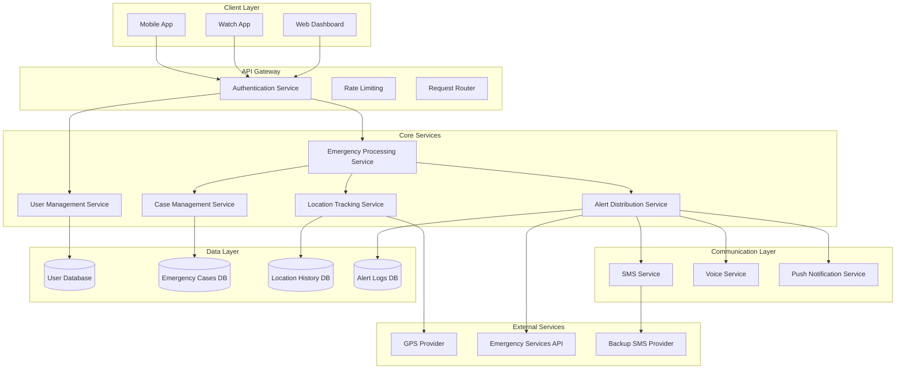

# Design Document: Emergency Alert System

## Overview

The Emergency Alert System is designed as a multi-layered, fault-tolerant application that prioritizes reliability and speed during emergency situations. The system follows a microservices architecture with clear separation between user management, alert processing, communication services, and location tracking. The design emphasizes redundancy, fallback mechanisms, and real-time processing to ensure emergency alerts reach contacts even under adverse conditions.

The system operates in two primary modes: standby (background monitoring) and active emergency (alert processing and case management). All components are designed to handle partial failures gracefully while maintaining core emergency functionality.

## Architecture

The system follows a layered architecture with the following key components:



### Key Architectural Principles

1. **Fault Tolerance**: Each service has backup mechanisms and graceful degradation
2. **Real-time Processing**: Emergency triggers processed within seconds
3. **Scalability**: Services can scale independently based on load
4. **Security**: End-to-end encryption and secure authentication
5. **Reliability**: Multiple communication channels and fallback options

## Components and Interfaces

### User Management Service

**Responsibilities:**
- User registration and authentication
- Profile management
- Emergency contact management
- Communication preferences

**Key Interfaces:**
```typescript
interface UserService {
  registerUser(userData: UserRegistration): Promise<User>
  authenticateUser(credentials: LoginCredentials): Promise<AuthToken>
  updateProfile(userId: string, updates: ProfileUpdate): Promise<User>
  addEmergencyContact(userId: string, contact: EmergencyContact): Promise<Contact>
  removeEmergencyContact(userId: string, contactId: string): Promise<void>
  getEmergencyContacts(userId: string): Promise<Contact[]>
}

interface User {
  id: string
  email: string
  phoneNumber: string
  name: string
  emergencyContacts: Contact[]
  communicationPreferences: CommunicationSettings
  createdAt: Date
  lastActive: Date
}
```

### Emergency Processing Service

**Responsibilities:**
- Trigger detection and validation
- Emergency case creation
- Coordination between services
- Escalation management

**Key Interfaces:**
```typescript
interface EmergencyProcessor {
  processTrigger(trigger: EmergencyTrigger): Promise<EmergencyCase>
  validateTrigger(trigger: EmergencyTrigger): Promise<boolean>
  escalateCase(caseId: string, reason: EscalationReason): Promise<void>
  closeCase(caseId: string, resolution: CaseResolution): Promise<void>
}

interface EmergencyTrigger {
  userId: string
  triggerType:  'button' |'voice' | 'watch'
  timestamp: Date
  location?: Coordinates
  metadata?: Record<string, any>
}
```

### Alert Distribution Service

**Responsibilities:**
- Multi-channel alert delivery
- Delivery status tracking
- Retry logic and fallback handling
- Message formatting

**Key Interfaces:**
```typescript
interface AlertDistributor {
  sendAlerts(caseId: string, contacts: Contact[], alertData: AlertData): Promise<DeliveryReport[]>
  retryFailedAlerts(caseId: string, failedDeliveries: DeliveryReport[]): Promise<DeliveryReport[]>
  sendToEmergencyServices(caseId: string, alertData: AlertData): Promise<DeliveryReport>
}

interface AlertData {
  message: string
  location: Coordinates
  timestamp: Date
  userInfo: UserInfo
  caseId: string
  urgencyLevel: 'high' | 'critical'
}
```

### Location Tracking Service

**Responsibilities:**
- Real-time location acquisition
- Location history management
- Accuracy validation
- Fallback positioning

**Key Interfaces:**
```typescript
interface LocationTracker {
  getCurrentLocation(userId: string): Promise<LocationData>
  startTracking(caseId: string, userId: string): Promise<void>
  stopTracking(caseId: string): Promise<void>
  getLocationHistory(caseId: string): Promise<LocationData[]>
}

interface LocationData {
  coordinates: Coordinates
  accuracy: number
  timestamp: Date
  source: 'gps' | 'network' | 'cached'
}
```

### Case Management Service

**Responsibilities:**
- Emergency case lifecycle management
- Status updates and notifications
- Case history and reporting
- Auto-escalation logic

**Key Interfaces:**
```typescript
interface CaseManager {
  createCase(trigger: EmergencyTrigger): Promise<EmergencyCase>
  updateCaseStatus(caseId: string, status: CaseStatus): Promise<EmergencyCase>
  getCaseDetails(caseId: string): Promise<EmergencyCase>
  getCaseHistory(userId: string): Promise<EmergencyCase[]>
  checkForEscalation(): Promise<string[]> // Returns case IDs needing escalation
}

interface EmergencyCase {
  id: string
  userId: string
  status: 'active' | 'resolved' | 'escalated'
  triggerType: string
  createdAt: Date
  resolvedAt?: Date
  location: LocationData
  alertsSent: DeliveryReport[]
  escalationLevel: number
}
```

## Data Models

### Core Entities

**User Entity:**
```typescript
interface User {
  id: string                    // Unique identifier
  email: string                 // Primary contact email
  phoneNumber: string           // Primary phone number
  name: string                  // Full name
  passwordHash: string          // Encrypted password
  emergencyContacts: Contact[]  // List of emergency contacts
  preferences: UserPreferences  // Communication and app settings
  createdAt: Date              // Account creation timestamp
  lastActive: Date             // Last app interaction
  isActive: boolean            // Account status
  bloodgroup:string            // User blood group
  address: string              // Current / permanent address
  security_pin : number        // Numerical password
  biometrics : biometric data from user device //face , fingerprint
}

interface UserPreferences {
  smsEnabled: boolean
  voiceEnabled: boolean
  watchEnabled: boolean
  locationSharing: boolean
  communicationPriority: ('sms' | 'voice' | 'push')[]
  autoEscalationMinutes: number
}
```

**Emergency Contact Entity:**
```typescript
interface Contact {
  id: string
  userId: string               // Reference to user
  name: string
  phoneNumber: string
  email?: string
  relationship: string         // e.g., "spouse", "parent", "friend"
  preferredMethod: 'sms' | 'voice' | 'both'
  priority: number             // 1 = highest priority
  isActive: boolean
  createdAt: Date
}
```

**Emergency Case Entity:**
```typescript
interface EmergencyCase {
  id: string
  userId: string
  status: 'active' | 'resolved' | 'escalated' | 'false_alarm'
  triggerType: 'button' | 'voice' | 'watch' | 'auto'
  triggerMetadata: Record<string, any>
  createdAt: Date
  resolvedAt?: Date
  resolvedBy?: string          // User ID or system
  resolutionReason?: string
  
  // Location data
  initialLocation: LocationData
  locationHistory: LocationData[]
  
  // Communication tracking
  alertsSent: DeliveryReport[]
  escalationHistory: EscalationEvent[]
  
  // Case management
  assignedResponder?: string
  notes: CaseNote[]
  escalationLevel: number      // 0 = normal, 1+ = escalated
}
```

**Location Data Entity:**
```typescript
interface LocationData {
  coordinates: Coordinates
  accuracy: number             // Meters
  altitude?: number
  timestamp: Date
  source: 'gps' | 'network' | 'wifi' | 'cached'
  address?: string             // Reverse geocoded address
}

interface Coordinates {
  latitude: number
  longitude: number
}
```

**Alert Delivery Entity:**
```typescript
interface DeliveryReport {
  id: string
  caseId: string
  contactId: string
  method: 'sms' | 'voice' | 'push' | 'emergency_services'
  status: 'pending' | 'sent' | 'delivered' | 'failed' | 'retry'
  attempts: number
  sentAt?: Date
  deliveredAt?: Date
  failureReason?: string
  messageContent: string
  cost?: number                // For billing tracking
}
```

### Database Schema Considerations

**Partitioning Strategy:**
- Emergency cases partitioned by date for efficient querying
- Location history partitioned by case ID and date
- Alert logs partitioned by month for retention management

**Indexing Strategy:**
- User ID indexes on all user-related tables
- Timestamp indexes for time-based queries
- Location-based spatial indexes for geographic queries
- Case status indexes for active case monitoring

**Data Retention:**
- Active cases: Indefinite retention
- Resolved cases: 2 years
- Location history: 30 days for resolved cases
- Alert logs: 1 year for audit purposes
- User data: Until account deletion + 30 days

## Correctness Properties

*A property is a characteristic or behavior that should hold true across all valid executions of a system—essentially, a formal statement about what the system should do. Properties serve as the bridge between human-readable specifications and machine-verifiable correctness guarantees.*

Based on the requirements analysis, the following properties ensure the emergency alert system operates correctly across all scenarios:

### User Management Properties

**Property 1: User registration creates unique accounts**
*For any* valid user registration data, creating a user account should result in a unique user ID and properly encrypted credentials stored in the system
**Validates: Requirements 1.1, 1.5**

**Property 2: Invalid registration data is rejected**
*For any* invalid or incomplete user registration data, the system should reject the registration and provide specific validation error messages
**Validates: Requirements 1.2**

**Property 3: Authentication round trip**
*For any* successfully created user account, authentication with the correct credentials should grant system access
**Validates: Requirements 1.3**

**Property 4: Profile updates are persistent**
*For any* valid profile update data, updating a user's profile should result in the changes being immediately saved and retrievable
**Validates: Requirements 1.4**

### Contact Management Properties

**Property 5: Emergency contact CRUD operations**
*For any* valid emergency contact data, adding the contact should make it available for alerts, updating should modify the stored data, and removing should exclude it from future alerts
**Validates: Requirements 2.1, 2.3, 2.4**

**Property 6: Contact validation prevents invalid data**
*For any* invalid contact information (phone numbers, emails), the system should reject the contact addition and display appropriate validation errors
**Validates: Requirements 2.2**

**Property 7: Contact capacity and display completeness**
*For any* user, the system should support at least 3 emergency contacts and display all required contact fields (name, phone, email, preferred method)
**Validates: Requirements 2.5, 2.6**

### Communication Configuration Properties

**Property 8: Communication method configuration**
*For any* communication method (SMS, voice, watch), enabling it should properly configure the corresponding service, and disabling it should remove it from active alert channels
**Validates: Requirements 3.1, 3.2, 3.3, 3.5**

**Property 9: Watch integration conditional functionality**
*For any* system state where watch integration is available, enabling it should activate watch-based emergency triggers
**Validates: Requirements 3.4**

**Property 10: Communication priority management**
*For any* valid priority ordering of communication methods, users should be able to set and modify the priority sequence
**Validates: Requirements 3.6**

### Standby Mode Properties

**Property 11: Standby mode resource efficiency**
*For any* device entering standby mode, the system should maintain voice listening and location connectivity while keeping resource usage within acceptable limits
**Validates: Requirements 4.1, 4.2, 4.3, 4.4**

**Property 12: Standby mode persistence and indication**
*For any* system restart, if standby mode was previously enabled, it should automatically resume with appropriate visual status indicators
**Validates: Requirements 4.5, 4.6**

### Emergency Trigger Properties

**Property 13: Trigger reliability and case creation**
*For any* emergency trigger method (button, voice, watch), activation should immediately create a unique emergency case and initiate alerts
**Validates: Requirements 5.1, 5.2, 5.3, 5.4**

**Property 14: Trigger deduplication**
*For any* simultaneous activation of multiple trigger methods, the system should process them as a single emergency event
**Validates: Requirements 5.5**

**Property 15: Trigger fallback mechanisms**
*For any* failed trigger registration, the system should attempt alternative trigger recognition methods
**Validates: Requirements 5.6**

### Alert Distribution Properties

**Property 16: Alert delivery timing and completeness**
*For any* emergency trigger, alerts should be sent to all configured emergency contacts within 30 seconds, containing complete emergency details and location information
**Validates: Requirements 6.1, 6.2, 6.3**

**Property 17: Alert delivery fallback and logging**
*For any* failed alert delivery, the system should attempt alternative communication methods, escalate to emergency services if all methods fail, and log all delivery attempts with their status
**Validates: Requirements 6.4, 6.5, 6.6**

### Location Tracking Properties

**Property 18: Location accuracy and inclusion**
*For any* emergency trigger, the system should determine location within 10 meters accuracy and include coordinates in all alerts when available
**Validates: Requirements 7.1, 7.2**

**Property 19: Location fallback and updates**
*For any* unavailable GPS service, the system should use network-based positioning as fallback, and during active cases, provide location updates every 60 seconds
**Validates: Requirements 7.3, 7.4**

**Property 20: Location privacy and disabled service handling**
*For any* disabled location services, the system should prompt users to enable them, use last known location, and share location data only with authorized recipients
**Validates: Requirements 7.5, 7.6**

### Case Management Properties

**Property 21: Emergency case lifecycle**
*For any* emergency trigger, a case should be created with complete metadata (timestamp, location, trigger method), maintain real-time status updates while active, and be properly closed when resolved
**Validates: Requirements 8.1, 8.2, 8.3**

**Property 22: Case escalation and history**
*For any* emergency case open longer than 2 hours, automatic escalation to emergency services should occur, and all cases should be maintained in user history with complete display information
**Validates: Requirements 8.4, 8.5, 8.6**

### Reliability and Fallback Properties

**Property 23: Communication fallback mechanisms**
*For any* failed primary communication service, the system should attempt delivery through backup providers and queue alerts for delivery when connectivity is restored
**Validates: Requirements 9.1, 9.2**

**Property 24: Service degradation handling**
*For any* unavailable service (location, voice recognition), the system should use appropriate fallbacks (last known location, alternative triggers) and perform daily health checks with user notifications
**Validates: Requirements 9.3, 9.4, 9.6**

**Property 25: Ultimate fallback to emergency services**
*For any* complete failure of all communication methods, the system should attempt direct contact with emergency services
**Validates: Requirements 9.5**

### Security and Privacy Properties

**Property 26: Data encryption and secure transmission**
*For any* personal data storage and emergency alert transmission, the system should use industry-standard encryption methods and secure communication protocols
**Validates: Requirements 10.1, 10.3**

**Property 27: Access control and authentication**
*For any* attempt to access personal information or system settings, the system should require proper user authentication
**Validates: Requirements 10.4**

**Property 28: Data retention and deletion compliance**
*For any* location data storage, retention should follow the 30-day policy for resolved cases, and account deletion should remove all personal data within 24 hours
**Validates: Requirements 10.2, 10.5**

**Property 29: Privacy compliance and user control**
*For any* user account, the system should provide required data control options in compliance with applicable privacy regulations
**Validates: Requirements 10.6**

## Error Handling

The emergency alert system implements comprehensive error handling across all components to ensure reliability during critical situations:

### Error Categories and Responses

**Communication Failures:**
- SMS delivery failures → Retry with exponential backoff, attempt backup providers
- Voice call failures → Retry with alternative voice services, fall back to SMS
- Network connectivity loss → Queue alerts locally, retry when connection restored
- All communication failures → Escalate to emergency services automatically

**Location Service Failures:**
- GPS unavailable → Fall back to network-based positioning
- All location services failed → Use last known location with timestamp indication
- Location accuracy below threshold → Include accuracy metadata in alerts

**Authentication and Authorization Errors:**
- Invalid credentials → Provide clear error messages, implement account lockout protection
- Session expiration → Graceful re-authentication flow
- Unauthorized access attempts → Log security events, notify user

**System Resource Errors:**
- Memory constraints → Prioritize emergency functions, gracefully degrade non-critical features
- Battery critical → Reduce background processing, maintain core emergency functionality
- Storage full → Purge old non-critical data, maintain emergency case data

**External Service Failures:**
- Emergency services API unavailable → Fall back to direct phone calls
- Watch integration lost → Provide alternative trigger methods prominently
- Third-party service degradation → Switch to backup providers automatically

### Error Recovery Strategies

**Graceful Degradation:**
- Core emergency functionality always maintained
- Non-essential features disabled under resource constraints
- Clear user communication about reduced functionality

**Automatic Recovery:**
- Self-healing mechanisms for transient failures
- Automatic service restoration when dependencies recover
- Background health monitoring and proactive issue detection

**User Notification:**
- Clear, actionable error messages
- System status indicators for service availability
- Proactive alerts for service degradation affecting emergency capabilities

## Testing Strategy

The emergency alert system requires a dual testing approach combining unit tests for specific scenarios and property-based tests for comprehensive coverage:

### Property-Based Testing

**Framework Selection:** Use Hypothesis (Python), fast-check (TypeScript), or QuickCheck (Haskell) depending on implementation language

**Test Configuration:**
- Minimum 100 iterations per property test to ensure statistical confidence
- Each property test tagged with: **Feature: emergency-alert-system, Property {number}: {property_text}**
- Randomized test data generation for users, contacts, locations, and emergency scenarios

**Property Test Categories:**

1. **User Management Properties (1-4):**
   - Generate random valid/invalid user registration data
   - Test authentication round-trips with generated credentials
   - Verify profile update persistence across random modifications

2. **Contact Management Properties (5-7):**
   - Generate random contact data with various validation scenarios
   - Test CRUD operations across different contact configurations
   - Verify capacity limits and display completeness

3. **Emergency Trigger Properties (13-15):**
   - Generate random trigger scenarios (voice, watch)
   - Test simultaneous trigger deduplication
   - Verify fallback mechanisms under various failure conditions

4. **Alert Distribution Properties (16-17):**
   - Generate random emergency scenarios with various contact configurations
   - Test delivery timing across different network conditions
   - Verify fallback chains and logging completeness

5. **Location Properties (18-20):**
   - Generate random location scenarios with varying accuracy
   - Test fallback mechanisms under GPS/network failures
   - Verify privacy controls and access restrictions

### Unit Testing

**Complementary Coverage:**
Unit tests focus on specific examples, edge cases, and integration points that property tests may not cover effectively:

**Critical Unit Test Areas:**

1. **Integration Points:**
   - External service API interactions
   - Database connection handling
   - Authentication token management

2. **Edge Cases:**
   - Boundary conditions for timing requirements (30-second alert delivery)
   - Maximum contact limits (3-5 contacts)
   - Location accuracy thresholds (10-meter requirement)

3. **Error Conditions:**
   - Specific failure scenarios for each external dependency
   - Network timeout handling
   - Invalid data format processing

4. **Security Scenarios:**
   - Authentication bypass attempts
   - Data encryption verification
   - Access control enforcement

**Test Data Management:**
- Use factories for generating consistent test data
- Implement test database seeding for integration tests
- Mock external services for isolated unit testing
- Maintain test data privacy (no real phone numbers/emails)

### Testing Infrastructure

**Continuous Integration:**
- All property tests run on every commit
- Unit tests provide fast feedback loop
- Integration tests run on staging deployments
- Performance tests validate timing requirements

**Test Environment Management:**
- Isolated test databases for each test suite
- Mock external services (SMS, voice, emergency services)
- Simulated location services for testing
- Test user accounts with known credentials

**Monitoring and Reporting:**
- Property test failure analysis and counterexample preservation
- Coverage reporting for both unit and property tests
- Performance regression detection
- Security test result tracking